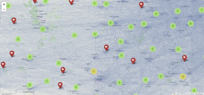

# **Homework 5 - USA Airport Flight Analysis**

The goal of this project is to build a Graph in order to compute the most significant features.

Then we have implemented by scratch the most important search algorithm in the Graphs, such as **Dijkstra** or **BFS**.  

All the data we've worked on was downloaded from the Kaggle [dataset](https://www.kaggle.com/datasets/flashgordon/usa-airport-dataset).
___

  

____

## **Project Structure**
___
- In this repository you can find:

     

  > __main.ipynb__:
  
     

    
    - A Jupyter Notebook where we gather all the answers and the explanations to the Research and Algorithmic Questions.
 
     
     
  > __functions.py__:
    
     

    - A python script where we have define the functions we have used in the `main.ipynb`
    
     

  > __assets/flight_network_map.html__:

     

    - *Folium* interactive map asked in the Q1
 
     
    
  

  
  

   

## **Collaborators - Group 12**
- [Marco Zimmatore](https://github.com/zimmy11)
- [Davide Vitale](https://github.com/wellohord)
- [Darkhan Maksutov](https://github.com/darkhmaks)
- [Riccardo Soleo](https://github.com/Ricksoleo)

